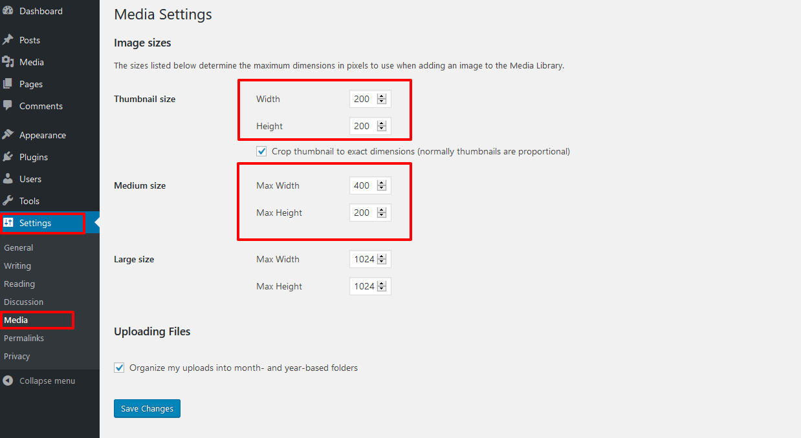

# Help Regenerate Thumbnails

## Description

In this lesson you will learn how to regenerate the thumbnails for your image attachments when you need to resize images to fit a certain theme.

* * *

## Prerequisite Skills

*   Basic knowledge of [installing and activating WordPress plugins](https://make.wordpress.org/training/handbook/lesson-plans/user-lessons/choosing-and-installing-plugins/)
*   [Managing Media](https://make.wordpress.org/training/handbook/lesson-plans/user-lessons/managing-media/)
*   Creating WordPress posts

* * *

## Assets

*   [Regenerate Thumbnails](https://wordpress.org/plugins/regenerate-thumbnails/) plugin
*   [Twenty Sixteen theme](https://wordpress.org/themes/twentysixteen/)
*   Pictures to resize: these two ([monkeys](//make.wordpress.org/training/files/2016/07/nepal_monkeys.jpg), [boats](//make.wordpress.org/training/files/2016/07/boats.jpg)) were used in the demonstration, you may choose any other pictures as well.

* * *

## Screening Questions

1.  Are you familiar with the concept of a plugin in WordPress?
2.  Have you been working with media in WordPress?
3.  Do you have a self-hosted WordPress website?
4.  Do you have a user role that allows you to install plugins?

* * *

## Teacher Notes

*   The recommended way to approach the scenarios would be to demonstrate and explain the process first and then ask students to repeat the actions using their own devices, while you’re available for questions and troubleshooting if something doesn’t work out.
*   It is easiest for students to work on a locally installed copy of WordPress. Set some time aside before class to assist students with installing WordPress locally if they need it or, if possible, send them out instructions before the class so they would come prepared. For more information on how to install WordPress locally, please visit our [Teacher Resource](https://make.wordpress.org/training/teacher-resources/)s page.
*   The preferred answer to the screening questions is “yes.” Participants who reply “no” to questions #1-2 might require a bit of explanation, and if they answer “no” to questions #3-4 they may be grouped with other students to work in pairs on the installation.
*   You may print out the Hands-On Walkthrough part to use it as handouts or send it out as a .pdf file to keep it green and preserve the links used throughout the document.

* * *

## Hands-on Walkthrough

### Introduction: Why you may need to regenerate thumbnails?

A problem that WordPress user can bump into one day is that their featured images appear cropped and out of proportion. This happens a lot after you have changed your Wordpress theme: normally when you upload images to WordPress they are being resized to the theme's requirements. So after you've changed it you may find the thumbnails for the previously uploaded images distorted as they have been sized according to the old theme's requirements. To remedy the situation, one can use [Regenerate Thumbnails](https://wordpress.org/plugins/regenerate-thumbnails/) plugin. Essentially it enforces creating copies of the old images sized according to the new WordPress theme's settings.

#### Media Settings

By default, WordPress gives you three image sizes that can be customized. They can be accessed and modified via the WordPress admin dashboard under **Settings > Media** section. These sizes are all generated when a new image is uploaded through the Media Library, so if you check the uploads folder you will see something like:

*   picture.jpg
*   picture-150×150.jpg
*   picture-300×300.jpg
*   picture-1024×1024.jpg

So here you see that in addition to the original picture.jpg three sizes were generated (and some extra sizes can also be registered via some of the plugins and themes). Those will be used further on in galleries, posts and for other purposes on your site.  As we mentioned earlier,  these files are created at the moment the files are uploaded to the media library. So if you change a theme later on, if there are some other requirements for the image sizes, there are no images to fill the requirements. In this case, WordPress will use the closest size it has available or the picture's original, which can lead to distorted design. This is where we need some help from Regenerate Thumbnails. [tip]In this lesson, we will demonstrate the way this plugin works via modifying image settings, not inter-exchanging themes with different requirements to simplify the process. The process is shown in Twenty Sixteen theme, but you can use another one of your liking as well.[/tip]

### Installing Regenerate Thumbnails plugin

Install the Regenerate Thumbnails plugin by Viper007Bond and activate it.  [tip]Note that in real life settings before adding and activating a new plugin, we recommend making a backup of your WordPress site. [/tip]

### Regenerating Thumbnails For All Media

#### Upload a picture

1\. Create a new post and choose to **Add Media** to it. Upload a picture to the media gallery and put it in the post draft twice. Make sure first time it's posted as **Thumbnail** and the second time as **Medium**.  2\. Publish the post.

#### Edit media settings

1\. Now edit the media settings of your images. Go to **Settings > Media** section and change the Thumbnail settings to 200x200 and Medium size to 400x200\. Choose to save the changes.  2\. Edit the previously created post and add a new thumbnail-sized image there. You will notice the old pictures are still left in the dimensions they were in, while the new one is sized as expected with the new theme's requirements, which is 50 pixels bigger in both dimensions. 

#### Enforce regenerating thumbnails

1\. To finally enforce regenerating the thumbnails for your site’s needs pick **Tools > Regen. Thumbnails** from the navigation menu on the left. 2\. Click **Regenerate All Thumbnails** to regenerate new image sizes as defined by your theme or on the **Settings > Media** page.  3\. Watch the conversion progress. Note that you may need to wait for quite a bit of time if your media library is large.  3\. Check out the post. As you see, despite the plugin’s name it regenerates all the images’ sizes, not only thumbnails, and now everything is according to new theme's requirements.  [tip]Normally, after you have updated the required images you may deactivate Regenerate Thumbnails. However, now keep it activated for this lesson's further tasks[/tip]

### Regenerating Thumbnails Only for Certain Images

When you need to regenerate sizes only the certain images, you can do that in **Media > Library** section. To do this you would need to click **Regenerate Thumbnails** link near the image you want to alter - and make sure you've switched to the list view first. 

### Alternative

Other possible choices to regenerate thumbnails would be [AJAX Thumbnail Rebuild](https://wordpress.org/support/plugin/ajax-thumbnail-rebuild) or [Force Regenerate Thumbnails](https://wordpress.org/plugins/force-regenerate-thumbnails/) plugins. If you use WP-CLI, which is a set of command-line tools for managing WordPress installations, the other option is to use _wp media regenerate_ command. The functionality to generate image size on-the-fly is also planned to be included into core WordPress functionality: [here](https://wpmag.ru/2014/wordpress-cli/) is a branch in WordPress bug tracker where you can look up the status of this update.

* * *

## Exercises

1.  Edit the media setting of your theme again to its initial values (for TwentySixteen, 150x150 for thumbnails and 300x300 for medium-sized).
2.  Regenerate thumbnails' sizes for the first picture you used but keep the modified size for the second one.

* * *

## Quiz

**When might you need to regenerate thumbnails for your website's media?**

1.  After WordPress was updated
2.  After you have switched themes
3.  When there is a plugin conflict
4.  When your WordPress version becomes outdated

**Answer** 2. After you have switched themes

**At which point are the additional sizes created for the pictures in your media gallery?**

1.  At the moment the files are uploaded to the media library
2.  At the moment the picture is inserted to the post
3.  At the moment a new theme is activated
4.  At the moment user requests for this picture in specific size

**Answer** 1. At the moment the files are uploaded to the media library

**Which image sizes are regenerated when using Regenerate Thumbnails plugin?**

1.  Thumbnails only
2.  Thumbnails and medium-sized
3.  All of the additional image sizes generated by WordPress

**Answer** 3. All of the additional image sizes generated by WordPress

### Lesson Wrap Up

 Follow with exercises and assessment outlined above.